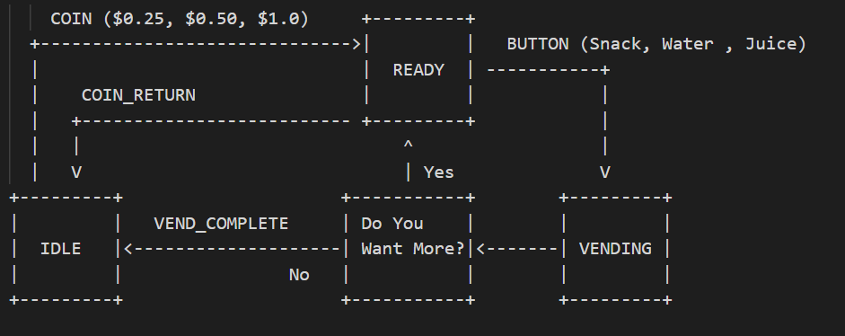
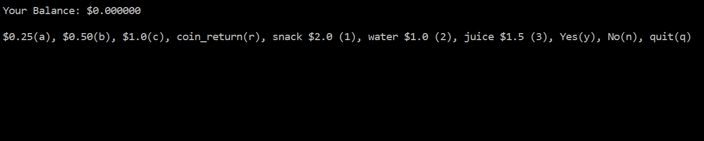
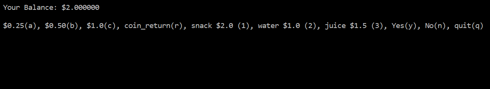
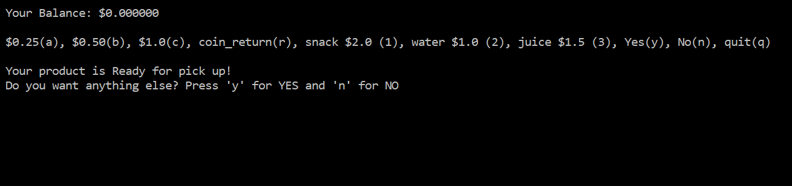
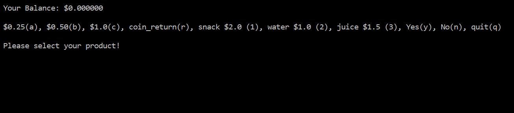
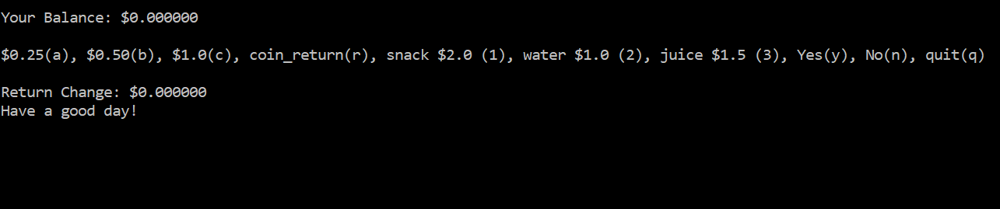
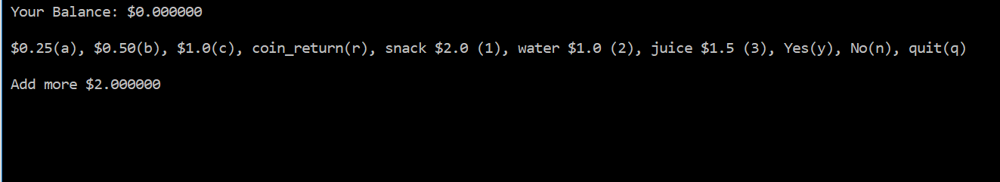

Vending Machine (ELMA Project)
===

[Elma](https://github.com/mihirmodi29/elma) is an event loop manager designed to teach embedded and reactive systems programming. This repository contains an example Vending Machine, showing how to use many Elma features, as well as illustrating how to arrange the files and directories in an Elma project.

Vending Machine is used to buy products like Snacks, Water or Juice. A customer can buy more than one product. Also the customer gets the change amount back in dollars.

The source code for this project is available [on github](https://github.com/mihirmodi29/vending-machine).

Installation
---

    git clone https://github.com/mihirmodi29/vending-machine
    cd vending-machine
    docker run -v $PWD:/source -it klavins/elma:latest bash
    make
    make docs

Execution
---
To run the stopwatch, type

    bin/vendingmachine

The vendingmachine is controlled via the keyboard, via these keys:
- **a**: Add coin $0.25
- **b**: Add coin $0.50
- **c**: Add coin $1.0
- **r**: Return the money back to customer
- **1**: Select snack
- **2**: Select water
- **3**: Select juice
- **y**: Select Yes
- **n**: Select No
- **q**: Quit

Architecture
---
State Machine: 

 The state machine shown in the diagram below for a vending machine. 
 
 - The initial state of the state machine is IDLE.
 - The state goes into READY when the customer inputs money into the machine.
 - The state goes into VENDING when the customer selects the product. (The state only goes to VENDING when exact or higher amount of dollars are input into the machine else the message is displayed to add the remaining amount.)
 - The product is ready for pickup if amount is equal or higher than the price of the product.
 - The customer is asked if they want anything else.
 - If the customer wants to buy more, the state goes to READY state.
 - If customer does not want any more products the state goes to IDLE state.
 - Unexpected input will not cause a state transition.
 
 
 
Results
---
IDLE State:
 

READY State (When customer enters amount):
 
 
 VENDING State (When customer selects the product):
 

 READY State (When customer wants more product):
 
 
 IDLE State (When customer is done with purchasing):
 
 
 READY State (When customer inputs less amount than the products price):
 
 
Acknowledgements
---
I would like to thank Prof. Klavins for the awesome coursework material. 

References
---
- https://github.com/klavinslab/elma_project

- https://github.com/klavins/ECEP520
